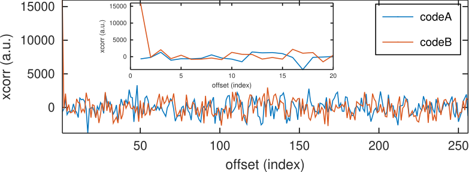

Cross correlation result by computing the inverse Fourier transform of the product
of the Fourier transforms of the signal and the transmitted code. Depends on CMSIS:
tune the Makefile constants to define the directory holding the FreeRTOS source tree
and CMSIS.

On this chart code B is code 1 which is the one transmitted in the noisy measurement, and
code A is code 2 which is orthogonal to code 1 and hence does not exhibit a correlation peak.

Can be tested with the ARM version of QEMU emulating the Texas Instruments Stellaris
LM3S6965 Cortex M4F core by running ``make qemu`` assuming ``qemu-system-arm`` is installed
on the host computer.
