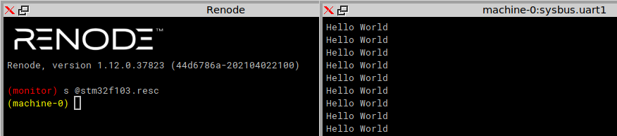

# tp_freertos
TP FreeRTOS on STM32F1VLDiscovery board or STM32F103 (update the LD script accordingly)

Assumes the Long Term Supported version of FreeRTOS as available at https://github.com/FreeRTOS/FreeRTOS-LTS 
(remember to ``git clone --recursive``) is located at the same level than this set of examples: tune the Makefiles
accordingly for the header files and libraries to reach this directory. Former versions of FreeRTOSv9.0.0 or 
FreeRTOSv10.0.0 can be used as well: in that case tune the parameters of Makefile.v9 accordingly).

Compilation flags:
* -DSTM32F1 or -DSTM32F1 to select whether the board is fitted with and STM32F100/STM32F103 microcontroller
or with a STM32F407 (STM32F4Discovery)
* in case -DSTM32F1 is selected, either select -DSTM32F10X_LD_VL for the STM32F100 ValueLine or the
-DSTM32F10X_MD MediumDevice
* in case -DSTM32F10X_MD is selected, then add -Dsenseor for running on the hardware board (SENSeOR reader
fitted with the XE1203F radiomodem) without resetting the FTDI (keeping the GPIO connected to the FT232
reset pin as input). For running on Qemu, do not enable -Dsenseor.

Using libopencm3 to provide system calls required by FreeRTOS running on the STM32 microcontroller (instead
of ST Microelectronics' libstm32) is described at http://www.jiggerjuice.info/electronics/projects/arm/freertos-stm32f103-port.html 
and was used in this set of demonstrations.

Tested with Andre Beckus' port of qemu to the stm32 (https://github.com/beckus/qemu_stm32): compile examples
for the STM32F103 (MD) device. Also tested with Renode (https://github.com/renode) emulating the STM32F103:

The Renode model has been updated to display GPIO/LED output state. Here also the very verbose gpioPortC status is displayed,
which can be removed by commenting (prefix with ``:``) the ``sysbus LogPeripheralAccess sysbus.gpioPortC`` line
in 1basic/stm32f103.resc

